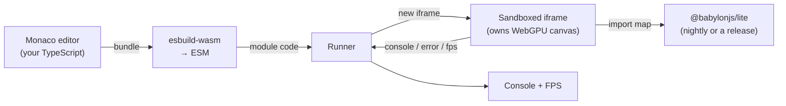

# The Babylon Lite Playground

The **[Lite Playground](https://liteplayground.babylonjs.com)** is the fastest way to try Babylon Lite. Write TypeScript with full IntelliSense, run it live on a WebGPU canvas, and save & share the result as a link — all in the browser, with **nothing to install**.

> 🌐 **Open it now: [liteplayground.babylonjs.com](https://liteplayground.babylonjs.com)**

> **Beta.** The Lite Playground is in beta — expect a few rough edges and occasional breaking changes while the experience stabilizes.

> New to Lite? Read **[Welcome](/lite)** for the big picture and **[Getting Started](/lite/01-getting-started)** for the mental model. The Playground is where you put that mental model to work without setting up a project.

---

## Requirements

- A **WebGPU-capable browser** — Chrome/Edge 113+, and recent Firefox and Safari. Babylon Lite is WebGPU-only, so the Playground is too.
- That's it. No Node, no bundler, no `npm install` — the editor, compiler, and engine all run in your browser.

---

## Why use it?

- **Zero setup.** Skip the install-and-configure step and start writing scene code immediately.
- **Learn by doing.** Load a built-in example, tweak it, and hit **Run** to see the result — the tightest possible feedback loop for learning the API.
- **Full IntelliSense.** The editor is wired with Babylon Lite's real type definitions, so autocomplete, hover docs, and inline errors all work against the actual engine API.
- **Share instantly.** Save a snippet and get a permalink you can drop into an issue, a forum post, or a bug report — the same snippet store the classic Babylon Playground uses.

---

## How to use it

### Write and run

The Playground opens on a starter scene. Edit the TypeScript in the left pane and press **Run** (the ▶ button, or **Ctrl/Cmd + Enter**) to execute it on the WebGPU canvas on the right. Every run starts from a clean slate, so you never have to reload the page.

Your code imports from the bare `@babylonjs/lite` specifier and grabs the canvas by id — exactly like a real app:

```typescript
import { createEngine, createSceneContext, /* … */ } from "@babylonjs/lite";

async function main() {
    const canvas = document.getElementById("renderCanvas") as HTMLCanvasElement;
    const engine = await createEngine(canvas);
    const scene = createSceneContext(engine);
    // … build your scene, then register and start …
}

main().catch((err) => console.error(err));
```

Anything you `console.log` shows up in the **Console** panel, and a live **FPS** readout and a **fullscreen** toggle sit in the top-right corner of the preview.

### Examples

The **Examples** dropdown in the toolbar seeds ready-made scenes — from a minimal starter to PBR, physics, and multi-file projects. Pick one as a starting point and modify it. Running an example is the quickest way to see a feature working end to end.

### Multiple files

Projects can span several files, just like the classic Playground's multi-file snippets. The tab bar above the editor lets you **add** (`+`), **rename** (double-click a tab), and **delete** (`×`) files, and the dot on each tab marks the **entry** file that the runner bundles from. Files import each other with relative specifiers:

```typescript
import { buildScene } from "./scene";
```

### Importing npm packages

Any bare import other than `@babylonjs/lite` is resolved from the [esm.sh](https://esm.sh) CDN at run time, so external ESM packages work with no configuration:

```typescript
import seedrandom from "seedrandom"; // resolved from esm.sh automatically
```

`@babylonjs/lite` itself stays pinned to the engine version you select (see below).

### Choosing the engine version

The **Engine version** dropdown selects which build of Babylon Lite the runner loads:

- **Nightly (latest source)** — the newest engine built straight from the repository, so you can try changes before they're published.
- **A published release** — any version from npm, fetched on demand from esm.sh.

This lets you reproduce a bug against a specific release, or confirm a fix has landed in nightly.

### Saving, sharing & downloading

- **Save** (the floppy icon) stores your project and copies a permalink to the clipboard. Re-saving a loaded snippet creates a new revision of the same link. **Save with details…** (the caret) also captures a title, description, and tags.
- **Download** (the down-arrow) exports the whole project as a self-contained, runnable zip: an `index.html`, the bundled `main.js`, and any local assets it references. Serve the folder and it runs exactly as it did in the Playground.

Assets should be referenced by an absolute `https://` URL (e.g. `https://assets.babylonjs.com/…`) so they resolve the same way everywhere.

---

## How it works

The Playground never ships your code to a server to compile it. Everything happens client-side:

1. **You edit** TypeScript in a Monaco editor (the same editor that powers VS Code), typed against Babylon Lite's real `.d.ts` so IntelliSense matches the engine.
2. **The Playground transpiles** your files in the browser with `esbuild-wasm`, bundling from the entry file, inlining your relative imports, keeping `@babylonjs/lite` external, and rewriting any other bare import to an esm.sh URL.
3. **A sandboxed iframe runs the result.** The bundled module executes inside a fresh iframe that owns the WebGPU canvas, with an import map that resolves `@babylonjs/lite` to the engine version you selected. Because each run recreates the iframe, a broken scene can never corrupt the surrounding UI — just fix and run again.
4. **The iframe reports back** — console output, runtime errors, and FPS — over `postMessage`, which the shell shows in the console and the FPS readout.



The upshot: the Playground is a real, self-contained Babylon Lite app builder that compiles and runs entirely on your machine — the same code you write here runs unchanged in a project you scaffold with `npm install @babylonjs/lite`.

---

## Embedding

The Playground can be embedded in another page — docs, a blog, or the classic Babylon Playground — as an iframe, and driven over a small `postMessage` API to load code and run it. This is how live, editable Lite demos are hosted inside written content.

```html
<iframe src="https://liteplayground.babylonjs.com/?embed=runner" title="Babylon Lite Playground" style="width: 100%; height: 480px; border: 0"></iframe>
```

`?embed=runner` shows just the canvas and console (best for demos); `?embed=split` shows a compact editor beside the canvas so readers can tweak the code themselves.

---

## Next steps

- 🚀 **[Getting Started](/lite/01-getting-started)** — the mental model behind the code you'll write in the Playground.
- 🔁 **[Porting Guide](/lite/03-porting-guide)** — translate a Babylon.js scene to Lite, then paste it in and run.
- 📊 **[Feature Comparison](/lite/02-feature-comparison)** — what Lite covers today, so you know what will run.
- 🌐 **[github.com/BabylonJS/Babylon-Lite](https://github.com/BabylonJS/Babylon-Lite)** — the source, including the Playground itself under `playground/`.

Built something worth sharing, or hit a rough edge? Save a snippet and **[open an issue](https://github.com/BabylonJS/Babylon-Lite/issues)** — early feedback directly shapes the roadmap. 💙
