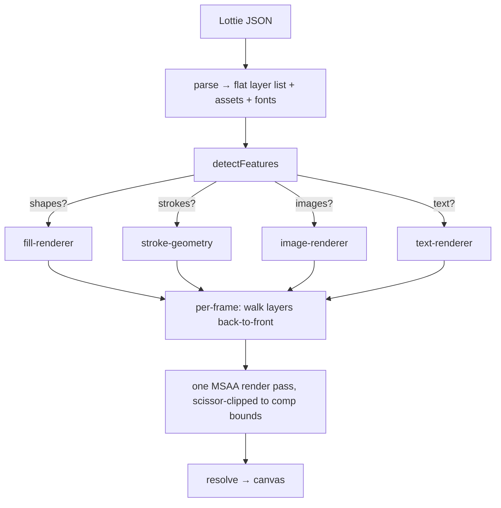

# Lottie Morph Renderer — Architecture

A tiny, function-based Lottie player that renders vector animations on the GPU using
**Babylon Lite** as the WebGPU engine. Built as a throwaway prototype to answer one
question: _how small can a correct, GPU-native Lottie renderer be if we only pay for the
features each animation actually uses?_

Across seven real Microsoft product animations (Teams, Fluent, three FRE variants, an EDU
quiz, and Pages), the answer is **6.8–11.2 KB gzip of player + engine code** — roughly an
order of magnitude smaller than `lottie-web`, while rendering on the GPU with MSAA
anti-aliasing and resolution independence.

> **Status:** research prototype. It renders the animations we've tested pixel-closely
> against `lottie-web`, but it implements a deliberate subset of the Lottie spec (see
> [What's supported](#whats-supported)).

---

## 1. The two problems, and how we solve them

A morphing/animated vector format like Lottie poses two separate problems. We solve them
with two independent techniques, and keeping them decoupled is what keeps the code small.

### Problem 1 — "Where is everything at time _t_?" (CPU)

Every frame we sample the animation: interpolate keyframes for transforms (position,
rotation, scale, opacity), gradient endpoints, and — for morphing shapes — the bezier
control points themselves. Lottie guarantees a **constant vertex count** across a path's
keyframes, so a shape morph is just a per-vertex linear interpolation of vertices and
in/out tangents, after applying the keyframe's cubic-bezier time easing.

This is unavoidable work in _any_ engine, but crucially it is **`O(control points)`**, not
`O(pixels)` — a few hundred points per frame for a typical logo. The CPU only ever touches
the tiny "skeleton" of the frame.

### Problem 2 — "Fill this arbitrary, concave, holey shape" (GPU)

The shape changes every frame, so we can't pre-rasterize to a sprite. We fill it on the GPU
with **stencil-then-cover**, the same technique used by GPU vector libraries (and the
OpenGL `NV_path_rendering` extension). Per path, two passes:

1. **Stencil pass** — flatten the bezier contour to a polyline, then draw a triangle fan
   from an anchor point to every edge with **two-sided stencil increment/decrement wrap**.
   The accumulated winding number in the stencil buffer _is_ the nonzero fill rule. No
   triangulation, no earcut, no SDF — concave shapes, self-intersections, and holes all
   resolve for free.
2. **Cover pass** — draw the shape's bounding-box quad, testing `stencil != 0`. The
   fragment shader evaluates the solid color or linear/radial gradient. `passOp = "zero"`
   resets the stencil so the next path starts clean.

Anti-aliasing comes from rendering into a **4× MSAA** target that resolves to the canvas.
Everything that scales with screen area (rasterization, gradients, AA, compositing) stays
on the GPU.

| Work                                 | Where   | Scales with                |
| ------------------------------------ | ------- | -------------------------- |
| Keyframe + transform interpolation   | CPU     | layers (~tens)             |
| Bezier morph + flattening            | CPU     | control points (~hundreds) |
| **Rasterization (stencil + cover)**  | **GPU** | **pixels (millions)**      |
| **Gradients, AA, alpha compositing** | **GPU** | **pixels**                 |

---

## 2. What gets rendered, and how it composites

The renderer treats a Lottie file as a flat, back-to-front list of **layers**, each of one
_kind_. A composition is rendered into a single MSAA render pass so all layers composite in
the correct z-order with one clear and one resolve:



Each layer kind is rendered by a **`LayerRenderer`** — a small plugin with a uniform
lifecycle. The player owns the frame pass and dispatches each layer to the renderer for its
kind:

```ts
interface LayerRenderer {
    readonly kind: number; // Lottie layer type this handles
    beginFrame(ctx): void; // reset per-frame accumulation
    emitLayer(layer, world, alpha, ctx): number; // accumulate CPU geometry → token
    flush(ctx): void; // upload all GPU buffers once
    recordLayer(pass, token): void; // record draws into the shared pass
    dispose(): void;
}
```

Per frame the player runs `beginFrame → emitLayer* → flush → recordLayer*`. Geometry is
accumulated on the CPU across all layers, uploaded to the GPU in one batch, then recorded in
z-order. This batches buffer uploads and keeps the GPU command stream tight.

---

## 3. The design principle: pay only for what you use

This is the heart of the prototype, and the reason it stays tiny. There are two layers to it:

1. **Source modularity** — every feature is its own module, never an `if` branch buried in
   a core renderer.
2. **Runtime gating** — a player that loads _arbitrary_ JSON at runtime can't be
   tree-shaken against a specific file. So the player **feature-detects first, then
   dynamically imports only the renderer modules that file needs.** Unused feature modules
   become separate chunks the browser _never downloads_.

```ts
const features = detectFeatures(anim);

if (features.shapes) {
    const { createFillRenderer } = await import("./fill-renderer.js");
    // strokes are a further-gated sub-feature, loaded only when width > 0 strokes exist
    const strokeGen = features.strokes ? (await import("./stroke-geometry.js")).buildStrokePoints : undefined;
    renderers.set(4, createFillRenderer(engine, strokeGen));
}
if (features.images) {
    /* await import("./image-renderer.js") */
}
if (features.text) {
    /* await import("./text-renderer.js") */
}
```

The dynamic `import()` is the load-bearing detail: the bundler splits each renderer into
its own chunk, fetched only if that line runs. A static import at the top would pull
everything into the bundle regardless. This mirrors the `detectLottieFeatures → dynamic
import` plan in the wider Babylon Lite Lottie design.

### Measured bundle sizes

The "bundle to play X" is **base (always loaded) + only the chunks X triggers**. Building
blocks (gzip): base **5.16 KB**, fill **3.45**, text **2.26**, image **1.70**, stroke **0.35**.

| Animation      | Features loaded | Player raw | **Player gzip** | JSON gzip |
| -------------- | --------------- | ---------: | --------------: | --------: |
| teams          | shapes          |   20.88 KB |     **8.95 KB** |  15.96 KB |
| pages          | shapes          |   20.88 KB |     **8.95 KB** |   6.55 KB |
| fluent         | images          |   14.89 KB |     **6.85 KB** |  63.16 KB |
| fre-hc         | shapes + text   |   25.08 KB |    **10.86 KB** |  12.00 KB |
| fre / fre-dark | shapes + text   |   25.60 KB |    **11.21 KB** |     ~9 KB |
| edu            | shapes + text   |   25.60 KB |    **11.21 KB** |  42.53 KB |

An image-only file (`fluent`) never downloads the vector or text code; a shapes file never
downloads the image rasterizer. The engine slice is tiny because the player deep-imports
Babylon Lite's `createEngine` rather than its full public barrel.

> Measured with `npx tsx measure/per-animation.ts`, which runs the _real_ feature detection
> on each file and maps it to code-split chunk sizes. The `.json` payload is reported
> separately — it's content, not player code.

---

## 4. Module map

```
src/
  lottie-raw.ts      Raw Lottie JSON types (the subset we consume)
  parse.ts           Walk JSON → flat plain-data layer list (+ assets, fonts)
  sample.ts          Per-frame keyframe sampling + bezier easing + morph + rect/ellipse
  matrix.ts          2D affine matrices (Lottie T·R·S·T(-anchor))
  geometry.ts        Adaptive cubic-bezier flattening → polyline
  feature-detect.ts  Which gated renderer modules does this animation need?
  layer-renderer.ts  The LayerRenderer plugin contract
  frame.ts           Shared MSAA + depth/stencil targets, the per-frame render pass, scissor
  player.ts          Ties it together: detect → import → per-frame walk → composite
  main.ts            Standalone viewer (engine + RAF loop + scrubber UI)

  fill-renderer.ts   [gated] Vector fill — stencil-then-cover + gradients (shape & solid layers)
  stroke-geometry.ts [gated] Stroke → triangle expansion (loaded only with visible strokes)
  image-renderer.ts  [gated] Image layers — decode → texture → quad
  text-renderer.ts   [gated] Text layers — Canvas2D fillText → texture → quad
```

**Everything is function-based plain data** — no class hierarchies, no methods on the data
types — matching Babylon Lite's design philosophy. The whole engine is, in essence, two
GPU pipelines (a stencil pipeline and a cover pipeline) plus a stencil buffer.

### How the renderers reuse each other

- **Solid layers** (`ty:1`, background rectangles) are synthesized at parse time into a
  full-size rect + solid fill and routed through the **fill renderer** — no new code.
- **Image and text layers** share the same premultiplied **textured-quad** approach; text
  is just "rasterize a string to a texture with Canvas2D, then draw it like an image."
- **Strokes** reuse stencil-then-cover (see below).

---

## 5. Notable correctness details (and the bugs they fixed)

These are the non-obvious things that make real animations render correctly. Each was found
by diffing against `lottie-web` (a local reference page, `lottie-ref.html`, renders the same
file side-by-side).

- **Compound paths / holes.** A glyph counter (the hole in a "P" or "O") is a second
  contour with opposite winding inside the outer one. We stencil **all** of a group's
  contours together before covering — the opposite winding cancels in the hole region
  (nonzero rule), so holes appear for free. The same mechanism handles "fake masks" (a
  background-colored rectangle with the content punched out as holes — a common Lottie trick
  that looks like masking but isn't).

- **Semi-transparent strokes.** A stroke is expanded into overlapping triangles (segment
  quads + round-join discs). Drawing those directly with a translucent color makes the alpha
  _accumulate_ at every overlap → a thick, bright halo. Fix: strokes also use
  **stencil-then-cover** (union the triangle coverage in the stencil buffer, then cover once
  at uniform alpha).

- **Layer parenting.** Layers inherit their parent's transform (not opacity). We resolve a
  layer's world matrix by walking the parent chain, memoized per frame. Null layers
  (`ty:3`) carry no content but are kept purely as transform parents. Essential for UI
  animations where dozens of elements hang off a few "rig" nulls.

- **Point text vs. box text.** Lottie text is either _point_ text (position = baseline
  anchor) or _box_ text (a `sz` size + `ps` box origin, with word-wrapping inside the box).
  Treating box text as point text shifts it by the box offset and skips wrapping. We detect
  `sz`/`ps` and word-wrap to the box width.

- **Composition clipping.** Lottie layers routinely extend beyond the comp rectangle;
  designers rely on the composition to clip them. We apply a **WebGPU scissor rect** to the
  comp bounds. Without it, content bleeds into the letterbox margins of a non-square comp.

---

## 6. Per-frame pipeline, in order

1. **Parse** (once): JSON → flat layer list, assets, fonts. Animatable values are kept as
   raw props and sampled per frame (no separate parsed-animation allocation).
2. **Detect + import** (once): feature-detect → dynamically import the needed renderer
   modules → build the `kind → LayerRenderer` map.
3. **Per frame** (`renderLottieFrame(player, frame)`):
    1. Compute the global projection (fit comp into canvas) and the scissor rect.
    2. `beginFrame` on every active renderer.
    3. Walk layers **back-to-front**; for each visible layer, resolve its world matrix
       (parent chain), sample its opacity, and `emitLayer` into the renderer for its kind.
    4. `flush` every renderer (one GPU upload each).
    5. Open the shared MSAA pass (scissor-clipped), `recordLayer` each emitted layer in
       z-order, resolve to the canvas.

The viewer (`main.ts`) drives this from a `requestAnimationFrame` loop with a scrubber; the
player itself has no opinion about playback — it just renders frame _t_.

---

## 7. What's supported

**Layers:** shape (`ty:4`), image (`ty:2`, embedded or URL), text (`ty:5`), solid
(`ty:1`), null (`ty:3`, transform parent).

**Shapes:** bezier paths (static + morphing), rectangles, ellipses, compound paths/holes,
merge-paths (mode "merge"). Nonzero fill rule.

**Paint:** solid fills, linear + radial gradients (with alpha stops), visible strokes
(round joins).

**Transforms:** anchor, position, scale, rotation, opacity — static or keyframed, with
cubic-bezier easing; layer parenting.

**Text:** point and box (wrapped) text via platform fonts (Canvas2D), per-weight font
resolution, fill color, justification, line height, letter spacing.

**Compositing:** premultiplied alpha, back-to-front z-order, 4× MSAA, comp-bounds clipping.

### What's deferred

Trim paths (partial-path reveal), per-glyph text animators, real track mattes / layer masks
(we've only encountered _faked_ masks so far), gradient strokes, even-odd fill rule,
precomps, and expressions. None are architecturally hard — each would be a new gated module
or a small sampler addition — they just weren't needed by the files tested.

---

## 8. Engine integration

The renderer drives Babylon Lite directly, with **no scene, camera, light, material, or
mesh** — these animations are always 2D. It uses:

- `createEngine(canvas, { alphaMode: "premultiplied", msaaSamples: 4 })` — for a transparent,
  anti-aliased surface.
- The engine's WebGPU device + swapchain to build its own two pipelines and drive its own
  render pass.
- A plain `requestAnimationFrame` loop (no engine render loop needed).

This keeps the engine slice in the bundle to ~2 KB — only the WebGPU setup, nothing else.

---

## 9. Tooling

- **`tools/analyze.mjs <file.json>`** — classifies every feature in a file as already
  _supported_ or _new_. The first step when evaluating a new animation.
- **`lottie-ref.html?file=<name>`** — renders the same file in `lottie-web` with a seek
  hook, for side-by-side visual diffing against the ground-truth renderer.
- **`measure/per-animation.ts`** — the per-animation bundle-size report (section 3).
- **`measure/gating.mjs`** — proves the gating: each renderer lands in a separate chunk.

---

## 10. Summary

The renderer is built on one insight: **separate the CPU "where is everything" problem from
the GPU "fill this shape" problem, solve the second with stencil-then-cover, and gate every
optional feature behind a dynamic import.** The result is a vector animation engine where:

- the CPU cost is bounded by _scene complexity_, never _resolution_;
- the GPU does all the per-pixel work, resolution-independently, with free AA;
- and each animation downloads only the code it actually uses — under 12 KB gzip even for
  the most complex file tested, engine included.
